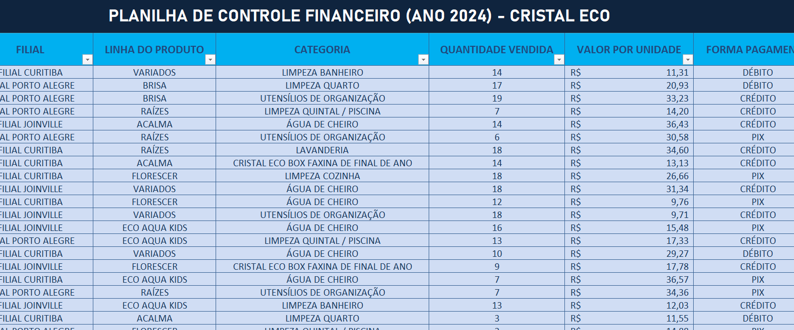
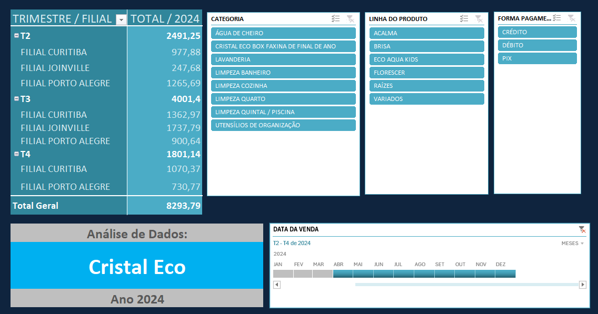

# 🌿 Projeto Cristal Eco

 O Projeto Cristal Eco simula um cenário real de uma empresa fictícia (desenvoldida por mim) do segmento de produtos de limpeza sustentáveis, criado com o objetivo    de aplicar, na prática, conceitos de limpeza, tratamento, análise e visualização de dados comerciais.
 
 A base de dados contempla as vendas ao longo do ano de 2024, permitindo análises temporais, identificação de padrões de consumo e avaliação de desempenho comercial.  Como resultado, o projeto entrega dashboards interativos e análises de vendas, organizados de forma clara e orientada à tomada de decisão.

## 🌱 Visão Geral
  * criação da marca fictícia
  * estruturação e padronização dos dados
  * limpeza e tratamento da base
  * construção de tabelas dinâmicas e dashboard interativo
  * documentação do processo analítico em PDF

## 🎯 Objetivo do Projeto
 Demonstrar competências práticas em:
  * Data Cleaning
  * Padronização e tratamento de dados
  * Análise exploratória de dados (EDA)
  * Construção de tabelas dinâmicas
  * Visualização de dados para apoio à decisão comercial
  * Dashboard Interativo

## 🔍 Estrutura do Repositório
  * 📂 **arquivos_excel/**: Contém todas as pastas de trabalho do projeto
  * 📂 **img/**: Dashboard Interativo.png
  * 📂 **documentacao_tecnica/**: Relatório técnico do projeto inteiro + análise dos dados comerciais
  * 📂 **csv/**: dados em formato csv

## 💻 Etapas do Desenvolvimento:
1. Dados_Brutos_2024
  * Base original sem modificações
  * Dados no formato bruto
  * Inconsistências propositais (maiúsculas/minúsculas/padronização)
  * Utilizada como fonte primária e referência
2. Dados_Tratados_2024 - Base após o processo completo de limpeza e tratamento
  * Padronização textual (letras maiúsculas)
  * Correção de inconsistências
  * Ajuste de tipos de dados
  * Organização estrutural das colunas
  * Validação dos registros
3. Tabela_Dinamica_2024
  Camada analítica do projeto.
  * Tabelas dinâmicas por:
  * trimestre
  * filial
  * categoria
  * linha de produto
  * forma de pagamento
  * Segmentações de dados (slicers)
  * Linha do tempo
  * Dashboard interativo
4. Manual_Projeto
  * Documentação completa do projeto em PDF
  * Apresentação da marca Cristal Eco
  * Contexto e objetivo do projeto
  * Explicação do processo de análise
  * Interpretação dos resultados de 2024
  * Uso do dashboard e recursos analíticos

## 💡 Ferramentas/técologias:
  * Microsoft Excel
  * Tabelas dinâmicas
  * Segmentação de dados
  * Linha do tempo
  * Dashboard interativo
  * Canva

## 📊 Resultados
  O projeto entrega uma visão clara do desempenho comercial da Cristal Eco em 2024, permitindo:
  * identificação de tendências
  * comparação entre filiais e períodos
  * suporte à tomada de decisão estratégica

## 🗺️ Abaixo estão exemplos visuais do processo de limpeza dos dados e do dashboard final desenvolvido no projeto:

### 🔹 Antes do tratamento de dados

### 🔹 Depois do tratamento de dados

### 🔹 Dashboard Interativo

### 📄 Relatório Técnico
> 💡Relatório Técnico do Projeto Cristal Eco:
> [📥 Baixar Relatório em PDF](./documentacao_tecnica/relatorio_tecnico_cristaleco.pdf)

